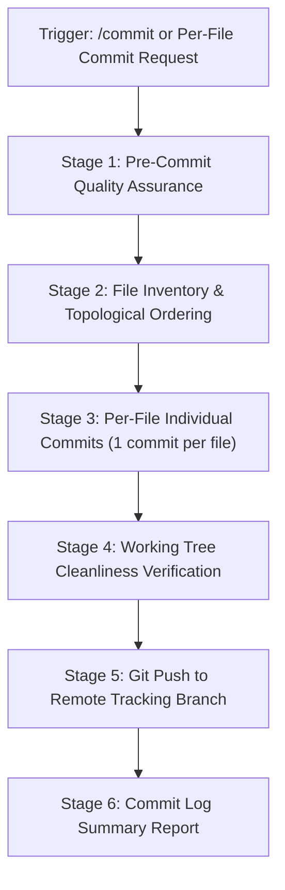

# Atomic Per-File Commit & Push Protocol (`/commit`)

This skill standardizes the **Atomic Per-File Commit Workflow** for **DSA Tracker Pro**.
When requested or triggered by `/commit`, each modified, created, or deleted file is staged and committed **individually** with its own tailored Conventional Commit message, followed by pushing the commits to the remote repository.

---

## ⚡ Workflow Sequence



---

## Stage 1: Pre-Commit Quality Assurance

Before making any commits, verify that the repository is in a healthy state so that zero broken code is written to Git history:

1. Run the pre-departure health check:
   ```powershell
   powershell -ExecutionPolicy Bypass -File .agents/skills/update/scripts/eod_check.ps1
   ```
   Or run the root quality gate:
   ```bash
   npm run qa
   ```
2. Verify exit code is 0 (all unit tests, typechecks, and schema checks pass).

---

## Stage 2: File Inventory & Ordering

Inspect all uncommitted changes:
```bash
git status -s
```

Categorize and order the files logically so that the commit history reads chronologically from foundational dependencies up to consumer interfaces:
1. **Infrastructure & Dependencies**: `docker-compose.yml`, `package.json`, `package-lock.json`
2. **Backend Core & Middleware**: `backend/middlewares/*`, `backend/db/*`, `backend/utils/*`
3. **Backend Routes & Services**: `backend/routes/*`, `backend/services/*`
4. **Frontend Utilities & Libraries**: `frontend/src/lib/*`, `frontend/src/hooks/*`
5. **Frontend Pages & Components**: `frontend/src/app/*`, `frontend/src/components/*`
6. **Browser Extensions**: `extension/*`
7. **Documentation & Daily Logs**: `README.md`, `docs/*`
8. **Agent Workflows & Skills**: `.agents/*`, `AGENTS.md`

---

## Stage 3: Per-File Individual Commits

For **every single file** in the inventory:

1. **Stage exactly that one file**:
   ```bash
   git add <filepath>
   ```

2. **Craft a specific Conventional Commit message**:
   Use standard types and appropriate scopes:
   - `feat(<scope>)`: New capability added in this file.
   - `fix(<scope>)` / `security(<scope>)`: Bug or vulnerability patched in this file.
   - `refactor(<scope>)`: Structural cleanup without functional change.
   - `chore(<scope>)`: Dependency updates, configs, build scripts.
   - `docs(<scope>)`: Readme, daily log, or documentation changes.

3. **Commit the single file**:
   ```bash
   git commit -m "<type>(<scope>): <concise, file-specific summary of changes>"
   ```

4. **Verify file is committed**:
   Ensure `git status -s` no longer shows that file as staged. Repeat until no modified or untracked files remain.

---

## Stage 4: Cleanliness Check

Ensure all files have been committed:
```bash
git status -s
```
*Requirement*: Must return an empty output (clean working tree).

---

## Stage 5: Git Push to Remote

Push all generated atomic commits to the remote branch:
```bash
git push origin <branch>
```
*Example*:
```bash
git push origin main
```
Verify exit code is 0 and remote is up-to-date.

---

## Stage 6: Commit Log Summary Report

Conclude the execution with a structured markdown table summarizing all generated commits:

```markdown
### 🚀 Atomic Commits & Push Summary

| # | Commit SHA | File | Conventional Message |
|---|------------|------|----------------------|
| 1 | `a1b2c3d`  | `docker-compose.yml` | `chore(docker): add Redis service and enforce required env keys` |
| 2 | `e4f5g6h`  | `backend/app.ts` | `feat(api): mount general rate limiter and central error handler` |
...
```
