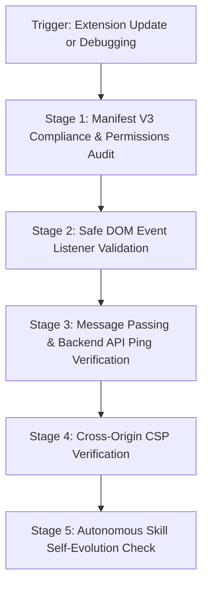

# Chrome Manifest V3 Extension & Bridge Runbook (`extension-sync`)

Governs the zero-click submission tracker (`extension/`) for **DSA Tracker Pro**. This extension bridges LeetCode submission events to the local DSA Tracker backend API, strictly complying with Manifest V3 sandbox security and Google/Gemini privacy standards.

---

## ⚡ Operational Workflow



---

## Stage 1: Manifest V3 & Minimal Permission Audit

Inspect `extension/manifest.json`:
1. **Manifest Version**: Must be `3`.
2. **Permissions**: Kept minimal:
   ```json
   "permissions": ["cookies", "storage", "tabs", "scripting"]
   ```
3. **Host Permissions**: Restricted strictly to target problem platforms and local backend endpoints:
   ```json
   "host_permissions": [
     "https://leetcode.com/*",
     "http://localhost/*",
     "http://127.0.0.1/*"
   ]
   ```
4. **Service Worker**: Verify `background.service_worker` points to `background.js`.

---

## Stage 2: Content Script Submission Listener Validation

In `extension/content.js`:
1. **Event Detection**: Ensure DOM observers or network event interceptors listen for the `Accepted` submission state.
2. **Data Extraction Scope**:
   - Extract strictly:
     - `problemSlug` (e.g. `two-sum`)
     - `problemId` (e.g. `1`)
     - `language` (e.g. `python3`, `cpp`)
     - `runtime` (ms)
     - `memory` (MB)
3. **Dispatch**: Dispatch payload via `chrome.runtime.sendMessage` to `background.js`.

---

## Stage 3: Background Service Worker & API Sync

In `extension/background.js`:
1. **API Endpoint**: Verify payload is posted to `http://localhost:5000/api/problems/sync` (or active backend port).
2. **Offline Buffer**: If backend is temporarily offline, ensure the submission is buffered in `chrome.storage.local` to retry upon reconnection.
3. **Zero Token Snooping**: The extension must only send problem submission metadata and authorized user app tokens; it must never intercept, forward, or inspect third-party authentication passwords or session cookies.

---

## 🛡️ Privacy & Security Compliance (Gemini Policy)

- **Strictly User-Consented Telemetry**: The extension must only execute in response to explicit problem submissions initiated by the user.
- **Zero Third-Party Credential Exfiltration**: Never read, copy, or transmit third-party session tokens, passwords, or personal account profile details.
- **No Remote Dynamic Code Injection**: All scripts must be self-contained within the extension bundle; no external `eval()` or un-sandboxed script loading is permitted.

---

## 🔄 Autonomous Skill Self-Evolution & Technology Modernization Protocol

Whenever new technologies, browser extension standards, or architectural updates are introduced (e.g., Chrome Manifest updates, WebExtensions polyfills, new browser security policies, LeetCode UI/GraphQL schema changes, or backend auth shifts like WebAuthn or OAuth):
1. **Manifest & API Modernization**: Automatically update this runbook and `extension/manifest.json` whenever Manifest V3 specifications evolve or new declarativeNetRequest / scripting APIs are standardized.
2. **Backend Endpoint & Payload Shifts**: If the submission API endpoint (`/api/problems/sync`) changes URL, payload shape, authentication headers, or validation rules, immediately update `extension/background.js` and this `SKILL.md` runbook.
3. **Platform Expansion**: If support for additional coding platforms (e.g. Codeforces, GeeksforGeeks, HackerRank) is introduced, automatically update `host_permissions`, content script selectors, and parsing logic in this file.
4. **Proactive Self-Update**: The agent must inspect and update this skill whenever extension files, network payloads, or browser permission APIs are modified.
