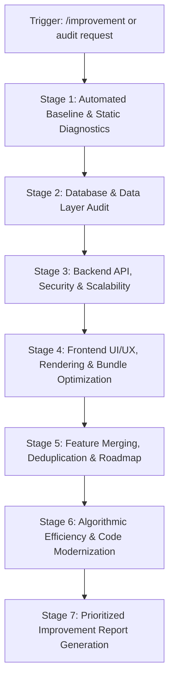

# Full-Stack Repository Improvement, Bug Fixes & Optimization Runbook (`/improvement`)

This runbook guides **Antigravity** through an exhaustive, multi-layered audit of **DSA Tracker Pro** across Frontend, Backend, Database, Cross-Platform layer, and Codebase Architecture.

When triggered (by `/improvement`, `improvement`, `/audit-full`, or requests for codebase enhancements), execute the following systematic audit workflow to discover bug fixes, architectural refactorings, UX improvements, database optimizations, feature consolidations, and write high-performance code.

---

## ⚡ Quick Execution Overview



### Automation Scripts

The skill includes automated multi-platform diagnostic runners in `scripts/`:
- **Node.js Cross-Platform Scanner**: [audit_project.mjs](./scripts/audit_project.mjs)
  ```bash
  node .agents/skills/improvement/scripts/audit_project.mjs
  ```
- **PowerShell (Windows)**: [audit_project.ps1](./scripts/audit_project.ps1)
  ```powershell
  powershell -ExecutionPolicy Bypass -File .agents/skills/improvement/scripts/audit_project.ps1
  ```
- **Bash (Linux / macOS)**: [audit_project.sh](./scripts/audit_project.sh)
  ```bash
  bash .agents/skills/improvement/scripts/audit_project.sh
  ```
- **Root NPM Gate**:
  ```bash
  npm run audit:improvements
  ```

---

## Stage 1: Automated Baseline & Static Diagnostics

Before manual inspection, execute the baseline automated checks to identify any active regressions, build failures, or lint issues:

1. **Run Improvement Scanner**:
   ```bash
   node .agents/skills/improvement/scripts/audit_project.mjs
   ```
2. **Verify Dual Prisma Parity**:
   ```bash
   npm run check:prisma-sync
   ```
   *Rule*: `backend/prisma/schema.prisma` and `frontend/prisma/schema.prisma` must be identical. If diverged, sync via `npm run sync:prisma`.
3. **TypeScript Type Integrity**:
   ```bash
   npm run typecheck
   ```
   *Rule*: Both backend and frontend must compile with 0 diagnostic errors.
4. **Test Suite Health**:
   ```bash
   npm test
   ```
   *Rule*: Verify Vitest passes for both services, routes, UI components, and AST engines.

---

## Stage 2: Database & Data Layer Deep Dive

Inspect the database layer ([backend/prisma/schema.prisma](file:///d:/DSA-Tracker/backend/prisma/schema.prisma)) and ORM query patterns:

1. **Foreign Key Indexing**:
   - Inspect all `@relation(fields: [fieldName])` declarations.
   - Every foreign key used in queries or cascade deletes (e.g. `userId`, `problemId`, `topicId`, `tagId`, `trackId`) MUST have an explicit `@@index([fieldName])` or composite index `@@index([fieldName, otherField])`.
   - *Anti-Pattern*: Unindexed foreign keys cause full table scans during JOIN operations and slow down cascading deletes.
2. **N+1 Query Detection**:
   - Inspect Prisma queries in `backend/routes/` and `backend/services/`.
   - Ensure related entities are fetched using Prisma's eager-loading `include` or explicit `select` rather than querying in `Array.prototype.map()` loops:
     ```typescript
     // ❌ Suboptimal (N+1 queries):
     const problems = await prisma.problem.findMany();
     const withProgress = await Promise.all(problems.map(async p => {
       const prog = await prisma.progress.findFirst({ where: { problemId: p.id, userId } });
       return { ...p, prog };
     }));

     //  Optimal (Single query via include):
     const problems = await prisma.problem.findMany({
       include: { progress: { where: { userId } } }
     });
     ```
3. **Query Bounds & Pagination**:
   - Verify every `.findMany()` call on potentially large collections (`Progress`, `SolutionHistory`, `ProblemNote`, `Problem`) defines explicit pagination (`take`, `skip`, or cursor-based pagination).
4. **PostgreSQL & SQLite Dual-Engine Parity**:
   - Ensure enum types and array fields (`String[]`) have safe migration strategies if SQLite is used in local development vs PostgreSQL in production.

---

## Stage 3: Backend API Architecture, Security & Reliability

Inspect Express routes in [backend/routes/](file:///d:/DSA-Tracker/backend/routes/) and services in [backend/services/](file:///d:/DSA-Tracker/backend/services/):

1. **Controller / Service Separation**:
   - Route files should primarily handle request parsing, parameter validation, and HTTP response dispatching.
   - Complex business calculations (SM-2 intervals, LeetCode synchronization, AI prompt generation, velocity scoring) must live in dedicated service classes or functions.
2. **Async Error Handling & Graceful Failures**:
   - Verify all async route handlers are wrapped in `try { ... } catch (error) { next(error); }` or utilize an async error wrapper.
   - Avoid unhandled promise rejections that could bring down the Node.js event loop.
3. **Input Validation & Sanitization**:
   - Validate incoming request bodies and parameters (using Zod, validator, or type guards) before processing.
   - Prevent SQL injection (stick strictly to Prisma parameterized calls; avoid raw unescaped SQL).
4. **Security & IDOR Defenses**:
   - Verify all user-scoped endpoints check `req.userId` against resource ownership.
   - Confirm rate limiters are mounted on high-frequency routes (auth, sync, AI generation).
   - Ensure zero secrets or API tokens are emitted in error responses or console logs.

---

## Stage 4: Frontend UI/UX, Component Health & Rendering Optimization

Inspect the Next.js 16 / React 19 frontend in [frontend/src/](file:///d:/DSA-Tracker/frontend/src/):

1. **Dynamic Code Splitting for Heavy Bundles**:
   - Heavy libraries must NOT be statically bundled into initial page chunks. Check for:
     * **Monaco Editor** (`@monaco-editor/react`): Dynamic import with `{ ssr: false }`.
     * **Three.js / React Three Fiber** (`three`, `@react-three/fiber`): Dynamically loaded on `/city` only.
     * **Recharts / ReactFlow** (`recharts`, `reactflow`): Dynamically loaded inside client dashboard tabs.
2. **Virtualization for Long Lists**:
   - Large problem lists (> 500 items in `/search` or `/problems`) should utilize `react-window` or virtual scrolling to maintain smooth 60 FPS scrolling and low DOM node count.
3. **Responsive Design & Mobile Viewport**:
   - Verify all grids, modals, split-screen IDE layouts, and navigation drawers adapt smoothly down to 375px mobile screens.
   - Ensure safe area padding (`env(safe-area-inset-bottom)`) for Capacitor Android/iOS navigation bars.
4. **UI/UX Polish & Feedback**:
   - Check that all asynchronous mutations (solving problems, adding notes, syncing LeetCode) provide immediate feedback:
     * Toast notifications via `sonner` (`toast.success`, `toast.error`).
     * Optimistic UI updates where applicable.
     * Skeleton loaders rather than abrupt layout shifts (prevent CLS).
5. **Accessibility (a11y) & Semantic HTML**:
   - Ensure buttons have descriptive `aria-label` attributes (especially icon-only buttons).
   - Use semantic tags (`<header>`, `<nav>`, `<main>`, `<article>`) instead of nested `<div>` soup.

---

## Stage 5: Feature Merging, Deduplication & Roadmap

Analyze the feature landscape for consolidation and strategic additions:

1. **Feature Merging & Deduplication**:
   - **Problem Drawers / Modals**: Unify disparate problem detail drawers across `/roadmap`, `/search`, and `/topics` into a single, cohesive component.
   - **Filter Controls**: Consolidate difficulty, status, and tag filtering logic into a reusable `useProblemFilter` hook.
   - **Shared API Hooks**: Eliminate duplicate `fetch` logic by standardizing on unified SWR/React Query caching patterns.
2. **High-Value Feature Additions**:
   - **Contest Mode / Timed Sprints**: A countdown timer simulating actual LeetCode contests with penalty calculations.
   - **Code Diff Viewer**: A side-by-side Monaco diff viewer comparing a user's initial brute-force attempt with their optimal accepted solution.
   - **Spaced Repetition Scheduler Enhancements**: Allow user-customizable SM-2 retention curves and review batch sizing.
   - **Offline Export / Import**: Single-click JSON backup of all solution histories and notes for zero vendor lock-in.

---

## Stage 6: Algorithmic Efficiency & Code Modernization

Audit code implementation details for computational performance and modern TypeScript idioms:

1. **$O(N^2)$ to $O(N)$ Conversions**:
   - Replace linear searches (`array.find(...)` inside an `array.map(...)`) with pre-computed `Map` or `Set` lookups.
     ```typescript
     // ❌ O(N * M) Suboptimal:
     const enriched = problems.map(p => ({
       ...p,
       progress: userProgressList.find(prog => prog.problemId === p.id)
     }));

     //  O(N + M) Optimal:
     const progressMap = new Map(userProgressList.map(prog => [prog.problemId, prog]));
     const enriched = problems.map(p => ({
       ...p,
       progress: progressMap.get(p.id)
     }));
     ```
2. **Eliminating Duplicate Types**:
   - Consolidate duplicated types across `frontend/src/types/` and backend interfaces.
   - Use Prisma-generated client types (`Prisma.ProblemGetPayload`, `ProgressStatus`) as the single source of truth.
3. **Eliminating `any` and Unsafe Casts**:
   - Refactor `any` to strict discriminated unions, unknown with type guards, or generics.
4. **Memoization & Re-render Prevention**:
   - Wrap expensive graph calculations (Dagre layout calculations in `RoadmapGraph`, AST parsing in `CodeVis`) in `useMemo`.

---

## Stage 7: Standardized Improvement Report Output Format

When presenting audit results to the user, format findings into a structured report using this template:

```markdown
# 🚀 Full-Stack Improvement & Optimization Report

**Audit Date**: [YYYY-MM-DD]
**Overall Architecture Health Score**: [XX/100]

---

## 🚨 Tier 1: Critical Bug Fixes & Blockers (P0)
*Issues causing data inconsistency, crashes, security leaks, or broken flows.*

- **[Issue Title]**
  - **Location**: [path/to/file:line](file:///d:/DSA-Tracker/path/to/file#L1-L10)
  - **Impact**: Detailed explanation of the bug.
  - **Proposed Fix**: Code diff or solution snippet.

---

## 🏛️ Tier 2: Major Architectural & Scalability Enhancements (P1)
*Database indexes, N+1 query elimination, bundle splitting, memory efficiency.*

- **[Enhancement Title]**
  - **Location**: [path/to/file](file:///d:/DSA-Tracker/path/to/file)
  - **Rationale**: Why this improves scalability or performance.
  - **Optimization**: Concrete before/after code.

---

## 🎨 Tier 3: Frontend UI/UX, Accessibility & Component Polish (P2)
*Component redesigns, responsive layout fixes, layout shift prevention, toast feedback.*

- **[UI/UX Enhancement]**
  - **Component**: [path/to/Component.tsx](file:///d:/DSA-Tracker/path/to/Component.tsx)
  - **Improvement**: Steps to elevate the user experience.

---

## 🧩 Tier 4: Feature Consolidation & Additions (P2)
*Features ready to merge, deduplicate, or high-value features to introduce.*

- **Candidate for Merge**: Unify X and Y into a single reusable module.
- **Recommended New Feature**: Strategic value, UX flow, and implementation roadmap.

---

## ⚡ Tier 5: Micro-Optimizations & Modern Code Crafting (P3)
*Algorithm complexity reductions ($O(N^2) \to O(N)$), type safety, eliminating `any`.*

- **[Refactoring Opportunity]**
  - **File**: [path/to/file.ts](file:///d:/DSA-Tracker/path/to/file.ts)
  - **Before**: Suboptimal implementation.
  - **After**: Modern, optimized code.

---

## 📋 Recommended Action Plan & Execution Order
1. [Step 1: Immediate fixes]
2. [Step 2: Architecture & Index updates]
3. [Step 3: Frontend polish & dynamic imports]
4. [Step 4: Feature consolidation]
```

---

## 🔄 Autonomous Skill Self-Evolution & Technology Modernization Protocol

Whenever new technologies, libraries, frameworks, or dependencies are introduced (e.g. Next.js upgrades, React 19+ concurrent features, Tailwind CSS updates, Prisma versions, new state management, AI SDK revisions, or new mobile/extension modules) or when codebase additions/updates occur:
1. **Automated Scanner Modernization**: The agent MUST update `scripts/audit_project.mjs`, `audit_project.ps1`, and `audit_project.sh` to add heuristics, bundle checks, and syntax audits reflecting the new technology stack.
2. **Runbook & Heuristic Adaptation**: Update audit checklists across Stages 2 through 6 to evaluate performance, security, and rendering against the latest architectural standards.
3. **Continuous Skill Evolution**: Proactively adapt this runbook without requiring human prompting whenever new frameworks, database engines, or UI libraries are integrated into the repository.
