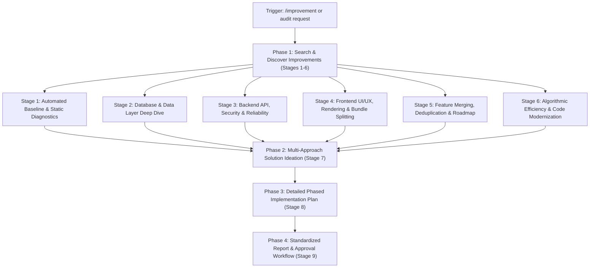
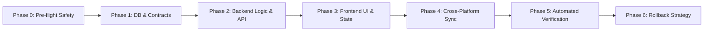

# Full-Stack Repository Improvement, Multi-Way Ideation & Execution Runbook (`/improvement`)

This runbook guides **Antigravity** through an exhaustive, multi-layered audit of **DSA Tracker Pro** across Frontend, Backend, Database, Cross-Platform layer, and Codebase Architecture.

When triggered (by `/improvement`, `improvement`, `/audit-full`, or requests for codebase enhancements), execute the following systematic workflow:
1. **Search for Improvements**: Scan and audit the full stack across Database, Backend, Frontend, Feature Duplication, and Algorithmic Efficiency.
2. **Multi-Way Ideation**: For every identified improvement, brainstorm and evaluate **multiple independent solution approaches** with an explicit trade-off matrix.
3. **Detailed Implementation Plan**: Synthesize the chosen/optimal approach into a rigorous, phased **step-by-step implementation plan** before applying changes.
4. **Report & Execution**: Present the structured report to the user and seamlessly transition into execution upon approval.

---

## ⚡ Quick Execution Overview



### Automation Scripts

The skill includes automated multi-platform diagnostic runners in `scripts/`:
- **Node.js Cross-Platform Scanner**: [audit_project.mjs](file:///d:/DSA-Tracker/.agents/skills/improvement/scripts/audit_project.mjs)
  ```bash
  node .agents/skills/improvement/scripts/audit_project.mjs
  ```
- **PowerShell (Windows)**: [audit_project.ps1](file:///d:/DSA-Tracker/.agents/skills/improvement/scripts/audit_project.ps1)
  ```powershell
  powershell -ExecutionPolicy Bypass -File .agents/skills/improvement/scripts/audit_project.ps1
  ```
- **Bash (Linux / macOS)**: [audit_project.sh](file:///d:/DSA-Tracker/.agents/skills/improvement/scripts/audit_project.sh)
  ```bash
  bash .agents/skills/improvement/scripts/audit_project.sh
  ```
- **Root NPM Gate**:
  ```bash
  npm run audit:improvements
  ```

---

## Stage 1: Automated Baseline & Static Diagnostics

Before manual inspection, execute baseline automated checks to identify any active regressions, build failures, or lint issues:

1. **Run Improvement Scanner**:
   ```bash
   node .agents/skills/improvement/scripts/audit_project.mjs
   ```
2. **Verify Dual Prisma Parity**:
   ```bash
   npm run check:prisma-sync
   ```
   *Rule*: [backend/prisma/schema.prisma](file:///d:/DSA-Tracker/backend/prisma/schema.prisma) and [frontend/prisma/schema.prisma](file:///d:/DSA-Tracker/frontend/prisma/schema.prisma) must be 100% identical. If diverged, sync via `npm run sync:prisma`.
3. **TypeScript Type Integrity**:
   ```bash
   npm run typecheck
   ```
   *Rule*: Both backend and frontend must compile with 0 diagnostic errors.
4. **Test Suite Health**:
   ```bash
   npm test
   ```
   *Rule*: Verify Vitest passes for both services, routes, UI components, and AST engines.

---

## Stage 2: Database & Data Layer Deep Dive

Inspect the database layer ([backend/prisma/schema.prisma](file:///d:/DSA-Tracker/backend/prisma/schema.prisma)) and ORM query patterns:

1. **Foreign Key Indexing**:
   - Inspect all `@relation(fields: [fieldName])` declarations across all Prisma models.
   - Every foreign key used in queries or cascade deletes (e.g. `userId`, `problemId`, `topicId`, `tagId`, `trackId`) MUST have an explicit `@@index([fieldName])` or composite index `@@index([fieldName, otherField])`.
   - *Anti-Pattern*: Unindexed foreign keys cause full table scans during JOIN operations and slow down cascading deletes.
2. **N+1 Query Detection**:
   - Inspect Prisma queries in [backend/routes/](file:///d:/DSA-Tracker/backend/routes/) and [backend/services/](file:///d:/DSA-Tracker/backend/services/).
   - Ensure related entities are fetched using Prisma's eager-loading `include` or explicit `select` rather than querying in `Array.prototype.map()` loops:
     ```typescript
     // ❌ Suboptimal (N+1 queries):
     const problems = await prisma.problem.findMany();
     const withProgress = await Promise.all(problems.map(async p => {
       const prog = await prisma.progress.findFirst({ where: { problemId: p.id, userId } });
       return { ...p, prog };
     }));

     // ✔ Optimal (Single query via include):
     const problems = await prisma.problem.findMany({
       include: { progress: { where: { userId } } }
     });
     ```
3. **Query Bounds & Pagination**:
   - Verify every `.findMany()` call on potentially large collections (`Progress`, `SolutionHistory`, `ProblemNote`, `Problem`) defines explicit pagination (`take`, `skip`, or cursor-based pagination).
4. **PostgreSQL & SQLite Dual-Engine Parity**:
   - Ensure enum types and array fields (`String[]`) have safe migration strategies if SQLite is used in local development vs PostgreSQL in production.

---

## Stage 3: Backend API Architecture, Security & Reliability

Inspect Express routes in [backend/routes/](file:///d:/DSA-Tracker/backend/routes/) and services in [backend/services/](file:///d:/DSA-Tracker/backend/services/):

1. **Controller / Service Separation**:
   - Route files should primarily handle request parsing, parameter validation, and HTTP response dispatching.
   - Complex business calculations (SM-2 intervals, LeetCode synchronization, AI prompt generation, velocity scoring) must live in dedicated service classes or functions.
2. **Async Error Handling & Graceful Failures**:
   - Verify all async route handlers are wrapped in `try { ... } catch (error) { next(error); }` or utilize an async error wrapper.
   - Avoid unhandled promise rejections that could bring down the Node.js event loop.
3. **Input Validation & Sanitization**:
   - Validate incoming request bodies and parameters (using Zod, validator, or type guards) before processing.
   - Prevent SQL injection (stick strictly to Prisma parameterized calls; avoid raw unescaped SQL).
4. **Security & IDOR Defenses**:
   - Verify all user-scoped endpoints check `req.userId` against resource ownership.
   - Confirm rate limiters are mounted on high-frequency routes (auth, sync, AI generation).
   - Ensure zero secrets or API tokens are emitted in error responses or console logs.

---

## Stage 4: Frontend UI/UX, Component Health & Rendering Optimization

Inspect the Next.js 16 / React 19 frontend in [frontend/src/](file:///d:/DSA-Tracker/frontend/src/):

1. **Dynamic Code Splitting for Heavy Bundles**:
   - Heavy libraries must NOT be statically bundled into initial page chunks. Check for:
     * **Monaco Editor** (`@monaco-editor/react`): Dynamic import with `{ ssr: false }`.
     * **Three.js / React Three Fiber** (`three`, `@react-three/fiber`): Dynamically loaded on `/city` only.
     * **Recharts / ReactFlow** (`recharts`, `reactflow`): Dynamically loaded inside client dashboard tabs.
2. **Virtualization for Long Lists**:
   - Large problem lists (> 500 items in `/search` or `/problems`) should utilize `react-window` or virtual scrolling to maintain smooth 60 FPS scrolling and low DOM node count.
3. **Responsive Design & Mobile Viewport**:
   - Verify all grids, modals, split-screen IDE layouts, and navigation drawers adapt smoothly down to 375px mobile screens.
   - Ensure safe area padding (`env(safe-area-inset-bottom)`) for Capacitor Android/iOS navigation bars.
4. **UI/UX Polish & Feedback**:
   - Check that all asynchronous mutations (solving problems, adding notes, syncing LeetCode) provide immediate feedback:
     * Toast notifications via `sonner` (`toast.success`, `toast.error`).
     * Optimistic UI updates where applicable.
     * Skeleton loaders rather than abrupt layout shifts (prevent CLS).
5. **Accessibility (a11y) & Semantic HTML**:
   - Ensure buttons have descriptive `aria-label` attributes (especially icon-only buttons).
   - Use semantic tags (`<header>`, `<nav>`, `<main>`, `<article>`) instead of nested `<div>` soup.

---

## Stage 5: Feature Merging, Deduplication & Roadmap

Analyze the feature landscape for consolidation and strategic additions:

1. **Feature Merging & Deduplication**:
   - **Problem Drawers / Modals**: Unify disparate problem detail drawers across `/roadmap`, `/search`, and `/topics` into a single, cohesive component.
   - **Filter Controls**: Consolidate difficulty, status, and tag filtering logic into a reusable `useProblemFilter` hook.
   - **Shared API Hooks**: Eliminate duplicate `fetch` logic by standardizing on unified SWR/React Query caching patterns.
2. **High-Value Feature Additions**:
   - **Contest Mode / Timed Sprints**: A countdown timer simulating actual LeetCode contests with penalty calculations.
   - **Code Diff Viewer**: A side-by-side Monaco diff viewer comparing a user's initial brute-force attempt with their optimal accepted solution.
   - **Spaced Repetition Scheduler Enhancements**: Allow user-customizable SM-2 retention curves and review batch sizing.
   - **Offline Export / Import**: Single-click JSON backup of all solution histories and notes for zero vendor lock-in.

---

## Stage 6: Algorithmic Efficiency & Code Modernization

Audit code implementation details for computational performance and modern TypeScript idioms:

1. **$O(N^2)$ to $O(N)$ Conversions**:
   - Replace linear searches (`array.find(...)` inside an `array.map(...)`) with pre-computed `Map` or `Set` lookups.
     ```typescript
     // ❌ O(N * M) Suboptimal:
     const enriched = problems.map(p => ({
       ...p,
       progress: userProgressList.find(prog => prog.problemId === p.id)
     }));

     // ✔ O(N + M) Optimal:
     const progressMap = new Map(userProgressList.map(prog => [prog.problemId, prog]));
     const enriched = problems.map(p => ({
       ...p,
       progress: progressMap.get(p.id)
     }));
     ```
2. **Eliminating Duplicate Types**:
   - Consolidate duplicated types across `frontend/src/types/` and backend interfaces.
   - Use Prisma-generated client types (`Prisma.ProblemGetPayload`, `ProgressStatus`) as the single source of truth.
3. **Eliminating `any` and Unsafe Casts**:
   - Refactor `any` to strict discriminated unions, `unknown` with type guards, or generics.
4. **Memoization & Re-render Prevention**:
   - Wrap expensive graph calculations (Dagre layout calculations in `RoadmapGraph`, AST parsing in `CodeVis`) in `useMemo`.

---

## Stage 7: Multi-Approach Solution Ideation & Trade-off Matrix ("Thinking of Multiple Ways")

After completing the search and identifying improvement candidates across Stages 1–6, **DO NOT jump into a single naive implementation**. Antigravity must systematically explore multiple independent ways to solve or enhance each problem area.

For each primary improvement target, brainstorm and contrast **at least 2 to 3 distinct approaches**:

### 1. The Three Architectural Archetypes
Every problem or enhancement must be considered through three lenses:

- **Approach A: Conservative / Targeted Patch (Quick Win)**
  - *Definition*: Minimal surgical code edits directly at the site of failure/bottleneck.
  - *Pros*: Lowest implementation risk, zero breaking changes, fast turnaround, minimal lines of diff.
  - *Cons*: Does not address underlying architectural debt; may require revisiting as scale increases.
  - *Best For*: Hotfixes, missing indexes, missing try/catch wrappers, simple prop adjustments.

- **Approach B: Architectural & Domain Abstraction (Recommended Refactor)**
  - *Definition*: Clean decoupling into dedicated services, custom React hooks, shared utilities, or domain patterns (e.g. Repository, Adapter, Observer).
  - *Pros*: Eliminates root cause, high reusability, modular testability, elegant separation of concerns.
  - *Cons*: Moderate implementation effort, touches multiple files, requires updating tests.
  - *Best For*: N+1 queries, shared business calculations, duplicate modal/filter components, code modularity.

- **Approach C: High-Performance & Future-Proof Scalable Engine (Radical Redesign)**
  - *Definition*: Complete re-engineering utilizing advanced patterns (e.g. Web Workers for AST parsing, client-side IndexedDB caching with optimistic mutation queue, full virtualization with binary search windowing, sub-millisecond materialized views).
  - *Pros*: Maximum scalability, near-zero latency, best-in-class user experience, eliminates future scaling ceilings.
  - *Cons*: Highest complexity, larger diff footprint, higher risk of regression, requires comprehensive end-to-end tests.
  - *Best For*: Core bottlenecks under heavy load (large datasets > 2,000 problems, real-time code execution, 3D city rendering).

### 2. Systematic Trade-off Evaluation Matrix
Evaluate each candidate approach against these 5 core architectural vectors:

| Evaluation Vector | Approach A (Targeted Patch) | Approach B (Domain Refactor) | Approach C (Radical Engine) |
| :--- | :--- | :--- | :--- |
| **1. Implementation Scope & Effort** | Low (1-2 files, < 30 mins) | Medium (3-6 files, 1-2 hours) | High (7+ files, multi-step) |
| **2. Computational / Big-O Gain** | Moderate (Local fix) | Significant (Systemic efficiency) | Maximum (Near-zero latency) |
| **3. Maintainability & Modularity** | Acceptable / Status quo | High (Decoupled, reusable) | Complex (Specialized abstractions) |
| **4. Regression & Breaking Risk** | Near Zero | Very Low (Well-typed contracts) | Moderate (Requires thorough QA) |
| **5. Cross-Platform Parity** | Instant compatibility | Verified across Web & Native | Requires mobile/offline adapters |

### 3. Explicit Recommendation Rationale
- State which approach is selected as **Recommended**.
- Explain the exact rationale: Why does this approach provide the optimal balance of engineering effort, runtime speed, developer ergonomics, and system stability for DSA Tracker Pro?

---

## Stage 8: Comprehensive Phased Implementation Blueprint ("Detailed Plan")

Once the optimal approach is selected (or when presenting multiple options for user confirmation), construct a comprehensive, phased **Detailed Implementation Plan** before touching application source code.

The plan must be structured into sequential, verifiable phases:



### 1. Plan Structure Specifications
The implementation plan must contain the following components:

1. **Executive Objective & Success Criteria**:
   - Clear statement of the problem being solved.
   - Quantitative success metrics (e.g., "Reduce initial bundle by 3.2MB", "Eliminate N+1 query reducing latency from 450ms to 28ms", "0 TypeScript errors").
2. **Pre-flight Verification & Safety Checks**:
   - Confirm git status is clean or branch is ready.
   - Run `npm run check:prisma-sync` to ensure DB schema parity.
   - Run `npm test` to capture baseline passing test count.
3. **Target File Inventory**:
   - Every file to be created, modified, or deleted must be listed with clickable links:
     * `[NEW] [filename](file:///d:/DSA-Tracker/path/to/file)`
     * `[MODIFY] [filename](file:///d:/DSA-Tracker/path/to/file#L1-L20)`
     * `[DELETE] [filename](file:///d:/DSA-Tracker/path/to/file)`
4. **Phased Execution Steps**:
   - **Phase 1: Database & Data Contracts**: Schema migrations, Prisma model updates, DTO validation schemas (Zod), shared TypeScript interfaces.
   - **Phase 2: Core Backend Engine & API Layer**: Controller routes, business service logic, error boundary middleware, rate limiting, and parameter validation.
   - **Phase 3: Frontend Architecture & UI/UX Polish**: State hooks, dynamic code-splitting (`next/dynamic`), component refactoring, loading states, Sonner toasts, mobile responsive styles.
   - **Phase 4: Cross-Platform & Resilience Integration**: Capacitor Android sync, Chrome extension message passing parity, PWA offline mutation queue handling.
   - **Phase 5: Automated Verification & Test Harness**: Writing or updating Vitest unit tests, running typecheck (`npm run typecheck`), linting (`npm run lint`), and full regression suite (`npm test`).
5. **Risk Mitigation & Rollback Strategy**:
   - Specific commands to safely revert changes if unexpected regressions appear during deployment.

---

## Stage 9: Standardized Improvement Report & Execution Workflow

When presenting audit results to the user, format findings into a structured report using this template:

```markdown
# 🚀 Full-Stack Improvement, Solution Ideation & Implementation Plan

**Audit Date**: [YYYY-MM-DD]
**Overall Architecture Health Score**: [XX/100]
**Target Improvement Candidate**: [Name of Feature / Bug / Performance Bottleneck]

---

## 🔍 Discovered Audit Findings Summary
- **[Issue Title]** (Tier: P0/P1/P2/P3)
  - **Location**: [path/to/file:line](file:///d:/DSA-Tracker/path/to/file#L1-L10)
  - **Current Bottleneck / Defect**: Description of root cause.
  - **Observed Impact**: Performance drag, security gap, or UX limitation.

---

## 💡 Multi-Approach Solution Ideation & Trade-off Matrix

### Option A: Conservative / Targeted Patch
- **Strategy**: [Summary of targeted patch]
- **Pros**: [Key benefits]
- **Cons**: [Limitations]

### Option B: Architectural & Domain Abstraction (⭐ Recommended)
- **Strategy**: [Summary of modular refactor]
- **Pros**: [Key benefits]
- **Cons**: [Limitations]

### Option C: High-Performance & Future-Proof Scalable Engine
- **Strategy**: [Summary of radical redesign]
- **Pros**: [Key benefits]
- **Cons**: [Limitations]

### ⚖️ Trade-off Comparison Table
| Metric | Option A (Patch) | Option B (Refactor) | Option C (Engine) |
| :--- | :--- | :--- | :--- |
| Implementation Effort | Low | Medium | High |
| Performance Gain | Moderate | Significant | Maximum |
| Code Modularity | Baseline | High | Specialized |
| Regression Risk | Minimal | Very Low | Moderate |
| Mobile & Offline Parity | Neutral | Seamless | Requires Adapters |

> **Recommendation Rationale**: Option B is recommended because it resolves the architectural root cause, provides clean testability, and guarantees long-term maintainability with minimal regression risk.

---

## 📋 Detailed Phased Implementation Plan

### Target Files
- `[MODIFY] [file1.ts](file:///d:/DSA-Tracker/path/to/file1.ts)` - [Summary of edit]
- `[NEW] [useHook.ts](file:///d:/DSA-Tracker/path/to/useHook.ts)` - [Purpose of new file]

### Phased Execution Steps
1. **Phase 1: Data Contracts & Types**
   - Update schemas or interfaces.
2. **Phase 2: Core Logic Implementation**
   - Implement service or hook logic with error handling.
3. **Phase 3: UI/UX & Dynamic Splitting**
   - Integrate component, add loading skeletons and toast notifications.
4. **Phase 4: Automated Verification**
   - Execute: `npm run typecheck && npm test`
5. **Phase 5: Rollback Contingency**
   - Steps to revert if needed.

---

## 🚦 Next Steps & Execution Approval
- **Option 1**: Proceed with execution of **Option B (Recommended Plan)**.
- **Option 2**: Execute alternative **Option A** or **Option C**.
- **Option 3**: Refine or customize specific steps before starting.
```

---

## 🔄 Autonomous Skill Self-Evolution & Technology Modernization Protocol

Whenever new technologies, libraries, frameworks, or dependencies are introduced (e.g. Next.js upgrades, React 19+ concurrent features, Tailwind CSS updates, Prisma versions, new state management, AI SDK revisions, or new mobile/extension modules) or when codebase additions/updates occur:
1. **Automated Scanner Modernization**: The agent MUST update `scripts/audit_project.mjs`, `audit_project.ps1`, and `audit_project.sh` to add heuristics, bundle checks, and syntax audits reflecting the new technology stack.
2. **Runbook & Heuristic Adaptation**: Update audit checklists across Stages 2 through 6 to evaluate performance, security, and rendering against the latest architectural standards.
3. **Ideation & Planning Evolution**: Ensure Stage 7 (Multi-Way Ideation) and Stage 8 (Detailed Implementation Plan) incorporate newly available framework patterns (e.g. Server Actions, optimistic mutations, Web Workers, IndexedDB).
4. **Proactive Self-Update**: Continuously synchronize this runbook during daily updates, commits, and audits without waiting for explicit human prompting.
