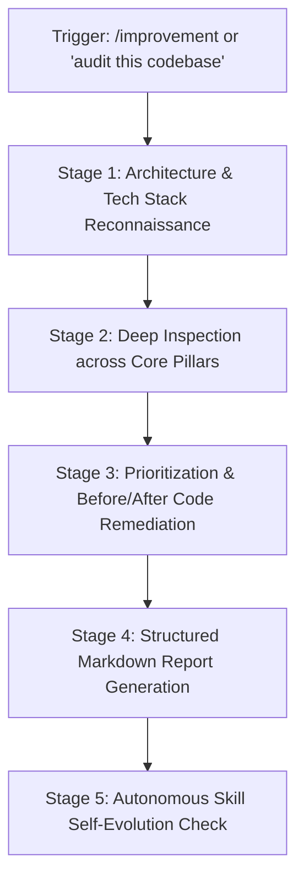

# Senior Full-Stack Engineering Code Review & Improvement Runbook (`/improvement`)

This skill standardizes the end-to-end audit and continuous improvement protocol for production applications. When triggered, execute an in-depth, opinionated, senior-level code review that identifies bugs, architectural bottlenecks, security vulnerabilities, code quality smells, and proactive feature enhancements, complete with line-specific before/after code snippets and prioritized findings.

---

## ⚡ Review Pipeline Overview



---

## Stage 1: Architecture & Tech Stack Reconnaissance

Before generating feedback, thoroughly understand the project context:
1. **Analyze Package Manifests**:
   - Inspect `package.json`, `requirements.txt`, `pyproject.toml`, or `docker-compose.yml`.
   - Identify core frameworks: Next.js (15/16 App Router), React 19, Tailwind CSS v4, TypeScript, Node/Express 5, Prisma, PostgreSQL, Flask/Python.
2. **Map Directory Architecture**:
   - Identify layer boundaries: API routes, controllers, services, database models, state management, client vs server components, and test coverage.
3. **Recognize Existing Design Patterns**:
   - Review how authentication (`JWT`, cookies, middleware), error handling, database transactions, and data fetching (SWR, React Query, Server Actions) are currently implemented.

---

## Stage 2: Specialized Stack Audit Heuristics

Apply specialized senior-level heuristics tailored to the target stack:

### 1. Next.js 15/16 & React 19 (App Router)
- **Server vs Client Boundaries**: Ensure `'use client'` is pushed down to leaf interactive components; prevent unnecessary client-side bundle bloat.
- **Async Request APIs**: In Next.js 15+, ensure `params`, `searchParams`, and `headers` are properly awaited where required.
- **React 19 Actions & Hooks**: Look for opportunities to use `useActionState`, `useOptimistic`, and `use()`; check for hydration mismatches and missing `<Suspense>` boundaries.
- **Caching & Revalidation**: Audit `fetch` cache options, `unstable_cache`, and `revalidateTag` to prevent stale data or over-fetching.

### 2. TypeScript & Type Safety
- **Zero Loose Types**: Flag `any`, unsafe type assertions (`as unknown as T`), and unvalidated runtime data (enforce Zod or Prisma-generated types).
- **Discriminated Unions & Exhaustiveness**: Verify state enums, API response envelopes, and error types.

### 3. Tailwind CSS 4
- **Modern Theme Tokens**: Flag legacy Tailwind v3 syntax; check for `@theme` directive alignment and clean semantic utility usage without arbitrary value sprawl.

### 4. Node.js & Express 5
- **Error Handling**: Verify centralized error middleware; confirm async route handlers don't leak unhandled promise rejections.
- **Resource Management**: Check for unclosed database connections, dangling event listeners, unbuffered stream operations, or missing timeouts.

### 5. Prisma & PostgreSQL
- **N+1 Query Detection**: Flag sequential database calls inside loops; replace with `include`, `select`, or batch `findMany({ where: { id: { in: ids } } })`.
- **Indexing & Constraints**: Verify foreign key indexes, compound indexes on frequent query filters, and unique constraints.
- **Transaction Safety**: Wrap multi-step mutations in `prisma.$transaction()` to avoid partial database writes.

### 6. Flask & Python
- **Blueprint Modularity & WSGI**: Ensure blueprints separate concerns cleanly; verify CORS, secret key configuration, and database session teardown.
- **Type Annotations**: Enforce PEP 484 type hinting and Pydantic validation for incoming request payloads.

---

## Stage 3: Finding Prioritization Framework

Every finding must be categorized by severity:
- **🚨 Critical**: Broken logic, active data corruption, critical security exploits (SQLi, IDOR, XSS, exposed secrets), crash-causing race conditions.
- **⚠️ High**: Significant performance bottlenecks (N+1 queries, memory leaks), missing authorization, unhandled edge cases causing 500 errors.
- **🔧 Medium**: Code smells, anti-patterns, missing types, suboptimal caching, architectural coupling.
- **✨ Low / Minor**: Naming conventions, code organization, small UX micro-interactions, dead code removal.

---

## Stage 4: Senior Improvement Report Structure

Format the output report according to this standardized structure:

```markdown
# 🚀 Comprehensive Project Improvement Report

**Target Project**: [Project Name / Module]
**Audited Stack**: [e.g. Next.js 16, React 19, Express 5, Prisma, PostgreSQL]
**Audit Date**: YYYY-MM-DD
**Senior Reviewer**: Antigravity Full-Stack Specialist

---

## Executive Summary
[High-level evaluation: overall health, architectural strengths, and primary areas of risk.]

---

## 🐛 Bug Fixes & Logic Defects (Critical / High)
### 1. [Short Bug Title]
- **Severity**: Critical | High
- **Location**: \`path/to/file.ext:L45-L60\`
- **Problem**: [Clear explanation of bug, race condition, or unhandled edge case]
- **Solution**: [Why this fix resolves it]
- **Before / After**:
\`\`\`diff
- old buggy code
+ new robust code
\`\`\`

---

## ⚠️ Major Changes (Architecture, Performance, Security & Scalability)
### 1. [Improvement Title]
- **Severity**: High | Medium
- **Component / Layer**: [e.g., Backend API / Prisma ORM / Frontend State]
- **Architectural Impact**: [Why current design will fail under scale or poses security risk]
- **Concrete Recommendation**:
\`\`\`typescript
// Production-ready implementation
\`\`\`

---

## 🔧 Minor Changes & Code Quality (Code Smells, Types & UX)
- [ ] **\`path/to/file.ts:L12\`**: [Issue description + recommendation]
- [ ] **\`path/to/file.tsx:L88\`**: [Issue description + recommendation]

---

## ✨ Proactive Feature Additions (Value-Add Recommendations)
### 1. [Feature Name]
- **User Value**: [Why users or developers benefit]
- **Implementation Strategy**: [How to integrate with existing architecture without disruption]
- **Scaffold Code / Pattern**:
\`\`\`typescript
// Quickstart pattern
\`\`\`

---

## 📁 File-by-File Breakdown Table
| File Path | Issues Found | Priority | Action Item |
| :--- | :--- | :--- | :--- |
| \`src/...\` | [Issue description] | High | [Action] |

---

## 🎯 Recommended Next Steps (Action Plan)
1. Step 1...
2. Step 2...
3. Step 3...
```

---

## 🛡️ Privacy & Security Compliance (Gemini Policy)

- **Strict Credential Masking**: During code inspection, if API keys, JWT secrets, database connection passwords, or personal credentials are found in code, redact them immediately in the report as `[REDACTED_SECRET]`. Never output raw secret strings.
- **Zero Unauthorized Access**: Only inspect files provided by the user or within the cloned repository. Never attempt to query private unauthorized external endpoints.
- **Safe Sandboxing**: Static review only; never execute unvalidated dynamic shell commands from external codebases.

---

## 🔄 Autonomous Skill Self-Evolution Protocol

Whenever this skill executes or when the project's tech stack changes:
1. **New Framework / Dependency Detected**: If a new major framework, ORM, or state library is added to the project (e.g. Drizzle, Redis, GraphQL, Zustand, Fastify), automatically update Stage 2 of this `SKILL.md` file with dedicated inspection heuristics for that technology.
2. **New Common Architectural Pattern**: If the team establishes a new project convention (e.g. Feature Flags, Clean Architecture Ports, CQRS), append it to the review criteria in this runbook.
