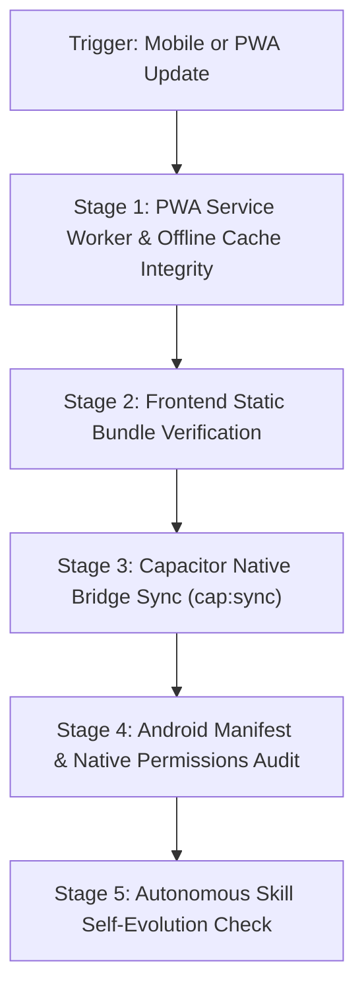

# Cross-Platform Mobile & Capacitor Sync Runbook (`mobile-sync`)

Governs native mobile packaging for Android via **Capacitor** and offline resilience via Next.js **PWA Service Workers** in **DSA Tracker Pro**.

---

## ⚡ Operational Workflow



---

## Stage 1: PWA Offline Resilience & Mutation Queue

1. **Service Worker Registration**:
   Verify that `frontend/public/sw.js` (or Next.js PWA worker) caches static assets, icon manifests, and offline shells.
2. **Offline Mutation Queue**:
   Ensure solved problem actions taken offline are queued in `IndexedDB` / `LocalStorage` and flushed automatically when `navigator.onLine` fires.

---

## Stage 2: Frontend Build Verification

Before syncing to native mobile containers, confirm the frontend builds without errors:

```bash
# Cwd: d:\DSA-Tracker\frontend
npm run build
```

---

## Stage 3: Capacitor Native Synchronization

Copy the latest exported web assets and sync native plugin configurations to Android:

```bash
# Cwd: d:\DSA-Tracker\frontend
npm run cap:sync
```

### Verification:
1. Verify that `frontend/android/app/src/main/assets/public/` receives the updated bundle.
2. Check `capacitor.config.ts` (or `capacitor.config.json`) for correct `appId`, `appName`, and `webDir` settings.

---

## Stage 4: Android Permissions & Native Security Audit

Inspect `frontend/android/app/src/main/AndroidManifest.xml`:
1. **Minimal Permissions**: Ensure only standard network permissions are requested:
   ```xml
   <uses-permission android:name="android.permission.INTERNET" />
   <uses-permission android:name="android.permission.ACCESS_NETWORK_STATE" />
   ```
2. **No Excessive Entitlements**: Disallow sensitive permissions (e.g. `READ_CONTACTS`, `ACCESS_FINE_LOCATION`, `CAMERA`) unless explicitly required by an active feature.
3. **Cleartext Traffic Policy**: Ensure `android:usesCleartextTraffic="false"` in release configurations.

---

## 🛡️ Privacy & Security Compliance (Gemini Policy)

- **Zero Keystore Exposure**: Never log, commit, or print Android signing keystores (`*.jks`, `*.keystore`), passwords, or alias certificates into Git or terminal logs.
- **Secure Native Storage**: Mobile tokens stored on device must utilize secure encrypted storage or secure cookies.

---

## 🔄 Autonomous Skill Self-Evolution Protocol

Whenever this skill executes or mobile configurations change:
1. **New Capacitor Plugin Added**: When a new plugin is installed (e.g. `@capacitor/haptics`, `@capacitor/network`, `@capacitor/status-bar`), immediately update this `SKILL.md` to document its sync requirements and configuration steps.
2. **New Native Platform Added**: If iOS or another mobile target is configured, add its corresponding sync and provisioning commands to this runbook.
