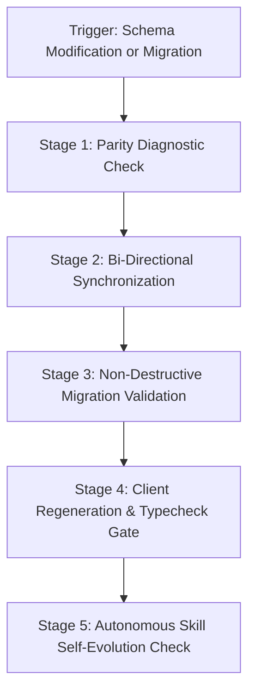

# Dual-Prisma Parity & Database Safety Runbook (`schema-guard`)

**DSA Tracker Pro** utilizes a synchronized dual-schema architecture:
- `backend/prisma/schema.prisma` (Primary source of truth for backend services)
- `frontend/prisma/schema.prisma` (Client-side typing and Next.js Prisma Client)

This skill enforces 100% byte-level schema parity, non-destructive migration safeguards, client generation, and database seed integrity.

---

## ⚡ Operational Workflow



---

## Stage 1: Schema Parity Diagnostic Check

Before making any changes or committing, verify whether the backend and frontend schemas are in sync:

```bash
# Cwd: workspace root
npm run check:prisma-sync
```

- If schemas match: Proceed to migration or seeding.
- If schemas differ: The command exits with code 1. Proceed to Stage 2.

---

## Stage 2: Schema Synchronization

1. **Synchronize Backend to Frontend**:
   If edits were applied to `backend/prisma/schema.prisma`:
   ```bash
   # Cwd: workspace root
   npm run sync:prisma
   ```

2. **Verify Integrity**:
   Confirm that both files match exactly and no unsaved changes were overwritten.

---

## Stage 3: Safe Non-Destructive Migration

1. **Format Schemas**:
   ```bash
   npx prisma format --schema=backend/prisma/schema.prisma
   npx prisma format --schema=frontend/prisma/schema.prisma
   ```

2. **Generate Migration Safely**:
   ```bash
   # Cwd: d:\DSA-Tracker\backend
   npx prisma migrate dev --name <descriptive_migration_name>
   ```

3. **Validate Database Seeding**:
   If roadmap data or initial topics need re-seeding:
   ```bash
   # Cwd: workspace root
   bash QUICKSTART_SEEDING.sh
   ```
   Or run the node seed script configured in `backend/prisma/seed.ts`.

---

## Stage 4: Client Regeneration & Typecheck Gate

Whenever schemas change, regenerate Prisma clients for both environments and ensure zero diagnostic errors:

```bash
# 1. Regenerate Backend Client
# Cwd: d:\DSA-Tracker\backend
npx prisma generate

# 2. Regenerate Frontend Client
# Cwd: d:\DSA-Tracker\frontend
npx prisma generate

# 3. Full Stack Typecheck
# Cwd: workspace root
npm run typecheck
```

*Requirement*: Both `typecheck:backend` and `typecheck:frontend` must pass with 0 errors.

---

## 🛡️ Privacy & Security Compliance (Gemini Policy)

- **Zero Plaintext Credentials**: Never commit database passwords or production connection URLs inside `schema.prisma`. Database URLs must reference `env("DATABASE_URL")`.
- **Destructive Operation Ban**: Never execute `npx prisma db push --force-reset` or drop production tables without explicit, unambiguous user confirmation and backup verification.

---

## 🔄 Autonomous Skill Self-Evolution Protocol

Whenever this skill executes or when database changes are made:
1. **New Database Model Added**: If a new model or enum is added (e.g., `ChallengeParticipant`, `InterviewSession`, `Badge`), automatically update this `SKILL.md` file to record the new model under the monitored models list.
2. **Seed Data Schema Changes**: If `dsa-roadmap-seed.json` shifts its JSON structure, update Stage 3 instructions with the updated seed script commands.
