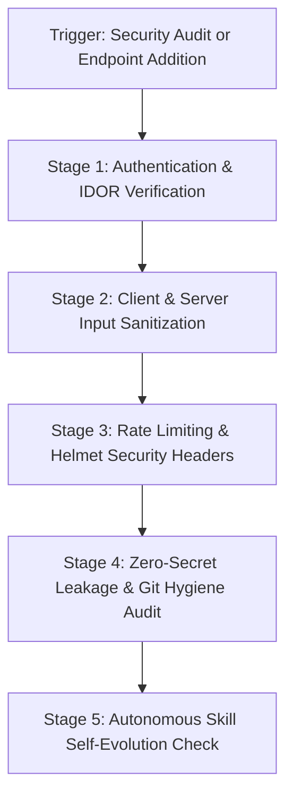

# Full-Stack Security, Auth & Secret Hygiene Runbook (`security-gate`)

Enforces enterprise-grade application security across **DSA Tracker Pro**, defending against Insecure Direct Object References (IDOR), Cross-Site Scripting (XSS), CSV Formula Injection, brute-force requests, and secret leakage.

---

## ⚡ Operational Workflow



---

## Stage 1: Authentication & IDOR Protection Verification

For every route in `backend/routes/*`:
1. **Enforce `requireAuth`**:
   All personalized resources (challenges, user notes, solution submissions, profile analytics) must route through `requireAuth` in [backend/middlewares/auth.ts](file:///d:/DSA-Tracker/backend/middlewares/auth.ts).
2. **IDOR Ownership Check**:
   Never trust user IDs from `req.params` or `req.body`. Always match against the verified token payload:
   ```typescript
   // Correct pattern:
   const item = await prisma.challenge.findFirst({
     where: { id: req.params.id, userId: req.userId }
   });
   if (!item) return res.status(404).json({ error: "Not found or access denied" });
   ```
3. **Admin Endpoints**:
   Ensure `requireAdmin` is enforced on all administrative routes (`backend/routes/admin.routes.ts`).

---

## Stage 2: Comprehensive Input Sanitization

1. **XSS Defense**:
   All user-provided markdown, solution descriptions, and study notes rendered in the DOM must be sanitized via `DOMPurify.sanitize()` (see `frontend/src/lib/sanitize.ts`).
2. **CSV Formula Injection Defense**:
   When generating CSV telemetry or problem exports, prefix any cell starting with `=`, `+`, `-`, or `@` with a single quote `'` to prevent command execution in Excel/Sheets.
3. **SQL Injection Defense**:
   Always use Prisma ORM parameterized methods. Forbid unescaped raw queries (`prisma.$queryRawUnsafe`).

---

## Stage 3: Rate Limiting & Security Headers

1. **Rate Limiting**:
   Verify `express-rate-limit` is actively mounted in `backend/middlewares/rateLimiter.ts`:
   - Auth endpoints: 5-10 requests / 15 minutes.
   - Sync endpoints: 60 requests / minute.
   - General API: 300 requests / 15 minutes.
2. **Helmet HTTP Headers**:
   Verify Helmet is enabled in `backend/app.ts`, enforcing `X-Content-Type-Options: nosniff`, `X-Frame-Options: DENY`, and strict Content Security Policy.

---

## Stage 4: Secret Hygiene & Git Isolation

Verify that no sensitive credentials or keys are exposed:

```bash
# Check status of untracked and modified files
git status -s
```

### Verification Checklist:
- [ ] `.env` and `.env.local` are strictly present in `.gitignore`.
- [ ] `JWT_SECRET`, `SESSION_SECRET`, and database connection credentials are never hardcoded.
- [ ] No API keys or credentials appear in test files, git logs, or transcripts.

---

## 🛡️ Privacy & Security Compliance (Gemini Policy)

- **Confidentiality**: Zero exposure of user passwords, salt hashes, private tokens, or PII.
- **Sanitized Logging**: All server logs must sanitize or redact token headers, emails, and passwords before stdout formatting.

---

## 🔄 Autonomous Skill Self-Evolution & Technology Modernization Protocol

Whenever new security technologies, authentication libraries, or backend security dependencies are introduced (e.g., NextAuth / Auth.js upgrades, Redis rate-limiting clusters, Helmet policy revisions, CSRF libraries, passkeys / WebAuthn, JWT algorithm upgrades, or cloud IAM shifts):
1. **Route & Endpoint Inventory Updates**: When new API routes or controllers are created, automatically audit them for `requireAuth`, IDOR defense, and input sanitization, adding them to this skill's security inventory.
2. **Middleware & Security Modernization**: When new security middlewares (e.g. distributed rate limiting with Redis, IP reputation, WAF rules, DOMPurify updates) are installed, update Stages 2 and 3 with active verification steps.
3. **Vulnerability Mitigation Evolution**: Update security checks whenever new OWASP Top 10 vulnerabilities, CVE dependencies, or AI prompt injection mitigation standards are recognized.
4. **Proactive Self-Update**: The agent must automatically review and modernize this runbook during security audits, auth refactoring, or dependency updates.
