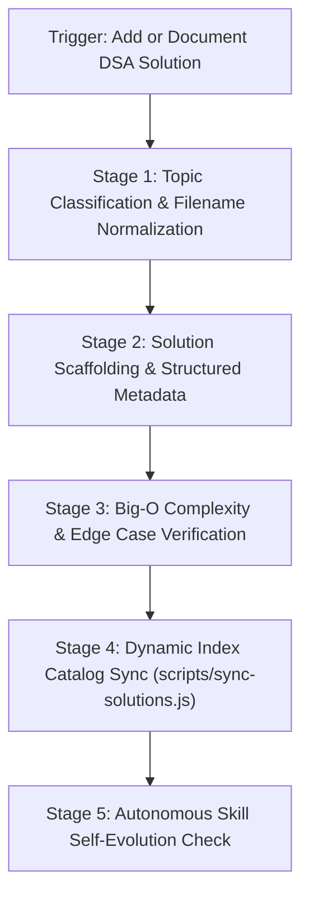

# DSA Solution Vault & Indexing Runbook (`solution-vault`)

This skill standardizes the end-to-end workflow for adding, documenting, analyzing, and indexing algorithmic problem solutions for **DSA Tracker Pro**. It guarantees clean code formatting, rigorous Big-O complexity documentation, multi-language parity, and dynamic synchronization with `solutions/README.md`.

---

## ⚡ Operational Workflow



---

## Stage 1: Topic Classification & Filename Normalization

1. **Locate Target Topic Folder**:
   Place the solution file into the appropriate category folder under `solutions/`:
   - `01-arrays-and-hashing`
   - `02-two-pointers`
   - `03-sliding-window`
   - `04-stack`
   - `05-binary-search`
   - `06-linked-list`
   - `07-trees-and-tries`
   - `08-heap-priority-queue`
   - `09-backtracking`
   - `10-graphs`
   - `11-dynamic-programming`
   - `12-greedy`
   - `13-bit-manipulation`
   - `14-math-and-geometry`
   - `15-advanced-topics`

2. **Standardize Filename**:
   The filename must follow the format `<4-digit-id>-<kebab-case-title>.<ext>`:
   - Example: `solutions/01-arrays-and-hashing/0001-two-sum.py`
   - Example: `solutions/05-binary-search/0704-binary-search.cpp`
   - Example: `solutions/06-linked-list/0206-reverse-linked-list.ts`

---

## Stage 2: Scaffolding with Standard Metadata Header

Every solution file must begin with standard structured metadata so that `scripts/sync-solutions.js` can parse and index it automatically:

### C++ / Java / TypeScript / JavaScript Template:
```cpp
/**
 * Problem: [Problem Title]
 * LeetCode ID: [Problem Number]
 * Difficulty: [Easy | Medium | Hard]
 * Topic: [Topic Name]
 * Time Complexity: O(...)
 * Space Complexity: O(...)
 * 
 * Approach:
 * [Detailed explanation of algorithmic intuition and data structures used]
 */
```

### Python Template:
```python
"""
Problem: [Problem Title]
LeetCode ID: [Problem Number]
Difficulty: [Easy | Medium | Hard]
Topic: [Topic Name]
Time Complexity: O(...)
Space Complexity: O(...)

Approach:
[Detailed explanation of algorithmic intuition and data structures used]
"""
```

---

## Stage 3: Complexity & Edge Case Standards

1. **Big-O Analysis**: Explicitly state both worst-case Time and auxiliary Space complexity with proof rationale.
2. **Boundary Testing**: Document how the solution handles critical edge cases:
   - Empty input collections / null pointers.
   - Single-element inputs.
   - Extreme constraint boundaries ($10^9$ or negative values).
   - Duplicate keys/values.

---

## Stage 4: Dynamic Solutions Index Synchronization

Whenever a solution is created or modified, execute the dynamic index generator:

```bash
# Cwd: workspace root
node scripts/sync-solutions.js
```

### Verification:
1. Verify `solutions/README.md` is updated.
2. Check that total problem count, difficulty breakdown, and topic distribution badges accurately reflect the changes.

---

## 🛡️ Privacy & Security Compliance (Gemini Policy)

- **Zero Scraping Abuse**: Do not run mass automated scraping against private or copyrighted paywalled solution databases. Solutions must be authored cleanly and original explanations provided.
- **No Secret Persistence**: Never place personal tokens, cookies, or account identifiers inside solution comments or metadata.

---

## 🔄 Autonomous Skill Self-Evolution Protocol

Whenever this skill is executed or when changes occur in the project:
1. **New Topic Directory Detected**: If a new folder is added to `solutions/` (e.g. `16-string-algorithms`), automatically edit this `SKILL.md` file to append the new topic to Stage 1.
2. **New Language Added**: If solutions in a new programming language (e.g. `Go`, `Rust`, `Kotlin`) are introduced, update `scripts/sync-solutions.js` and edit this `SKILL.md` to include its file extension and comment template.
