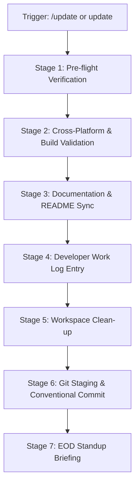

# End-of-Day Repository Sync & Update Runbook (`/update`)

This skill standardizes the complete end-of-day / pre-departure checklist for **DSA Tracker Pro**.
When triggered (e.g. by `/update`, `update`, or `uypdate`), execute all 7 stages autonomously without requiring step-by-step confirmation.

---

## ⚡ Quick Execution Flow



---

## Stage 1: Pre-Flight Verification & Quality Gates

Run all quality checks to ensure zero regressions before committing:

1. **Frontend Type Check**:
   ```bash
   cd frontend
   npx tsc --noEmit
   ```
   *Requirement*: Exits with code 0 (no TypeScript diagnostic errors).

2. **Frontend Test Suite**:
   ```bash
   cd frontend
   npm test
   ```
   *Requirement*: All unit, component, and integration tests must pass.

3. **Backend Test Suite**:
   ```bash
   cd backend
   npm test
   ```
   *Requirement*: All service, model, and route tests must pass.

4. **Linting Check**:
   ```bash
   cd frontend
   npm run lint
   ```
   *Requirement*: Check for formatting or syntax errors.

---

## Stage 2: Cross-Platform & Build Validation

1. **Mobile Platform Sync (Capacitor)**:
   - If UI components, assets, or configs were modified, ensure Capacitor sync is updated:
     ```bash
     cd frontend
     npx cap sync
     ```
2. **Chrome / Edge Extension**:
   - Check `extension/manifest.json` and background/content scripts for syntax consistency.
3. **Build Check (if critical core files changed)**:
   - Run `npm run build` in `backend/` and `frontend/` if major production bundling needs verification.

---

## Stage 3: Documentation & README Synchronization

Inspect recently touched code and update documentation to reflect actual project state:

1. **`README.md`**:
   - Verify feature lists and deep dive sections reflect any new components or routes.
   - Update tech stack and directory architecture tree if new files/directories were added.
   - Update test suite metrics (`npm test` numbers).
   - Ensure all markdown links and anchors remain valid.
2. **`docs/` Directory**:
   - If architecture, API endpoints, or database schema changed, update relevant documents in `docs/` (`docs/architecture.md`, `docs/developer-operations.md`).

---

## Stage 4: Developer Daily Log (`docs/DAILY_LOG.md`)

Maintain an immutable daily record of all engineering activity:

1. Open `docs/DAILY_LOG.md` (create if absent).
2. Append a new timestamped log block under today's date (format: `YYYY-MM-DD`):
   - **Features & Enhancements**: Specific capabilities added.
   - **Bug Fixes & Refactors**: Specific issues resolved.
   - **Test Results**: Exact test suites and assertions passed.
   - **Modified Components**: List of files updated or created.
   - **Status**: Ready for push / in progress.

---

## Stage 5: Workspace Clean-up & Artifact Hygiene

Ensure the working tree is pristine:

1. Inspect `git status` for untracked files.
2. Ensure temporary scratch files, debug logs, or mock dumps are deleted or added to `.gitignore`.
3. Verify no secrets, `.env` files with real API keys, or private credentials are staged.

---

## Stage 6: Git Version Control & Commit

Create a high-quality, descriptive commit in Git history:

1. **Stage all verified files**:
   ```bash
   git add -A
   ```
2. **Review staged diff**:
   ```bash
   git status
   ```
3. **Commit with Conventional Commits format**:
   Use standard prefixes (`feat:`, `fix:`, `test:`, `docs:`, `refactor:`, `chore:`):
   ```bash
   git commit -m "<type>(<scope>): <concise summary>" -m "<detailed description of changes>"
   ```
4. **Check Remote Tracking**:
   ```bash
   git status -sb
   ```
   *Note: Notify the user if the local branch is ahead of `origin/main` so they can choose when to `git push`.*

---

## Stage 7: EOD Standup Briefing & Summary

Conclude the update execution with a crisp developer summary formatted in markdown:

- 📋 **Commit SHA & Title**: E.g. `c74fa12 (feat(analytics): add Recharts radar and CodeVis sandbox)`
- 🧪 **Test Suite Health**: Exact test counts passed (Frontend + Backend).
- 📑 **Docs & Log Status**: Confirmation that `README.md` and `docs/DAILY_LOG.md` are synchronized.
- 🚀 **Next Steps**: Recommended priorities for the next coding session.
