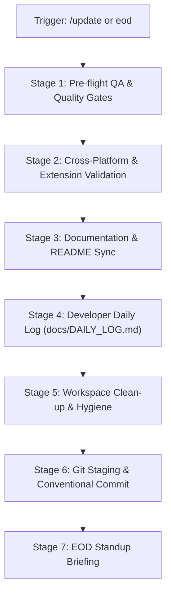

# End-of-Day Repository Sync & Update Runbook (`/update`)

This skill standardizes the complete end-of-day / pre-departure checklist for **DSA Tracker Pro**.
When triggered (e.g., by `/update`, `update`, `uypdate`, `eod`, or `wrap up`), execute all 7 stages autonomously without requiring turn-by-turn confirmation unless an unrecoverable test or build failure blocks departure.

---

## ⚡ Quick Execution Overview



### Automation Helpers

The skill includes executable multi-platform verification scripts in `scripts/`:
- **PowerShell (Windows)**: [eod_check.ps1](./scripts/eod_check.ps1)
  ```powershell
  powershell -ExecutionPolicy Bypass -File .agents/skills/update/scripts/eod_check.ps1
  ```
- **Bash (Linux / macOS)**: [eod_check.sh](./scripts/eod_check.sh)
  ```bash
  bash .agents/skills/update/scripts/eod_check.sh
  ```
- **Root NPM Unified Gate**:
  ```bash
  npm run qa
  ```
  *(Runs Prisma sync check, backend & frontend TypeScript typechecks, ESLint, and all Vitest suites).*

---

## Stage 1: Pre-Flight Verification & Quality Gates

Run all quality checks to guarantee zero regressions. Always execute commands with the appropriate `Cwd` or use root package scripts.

1. **Prisma Schema Synchronization**:
   - Verify `backend/prisma/schema.prisma` and `frontend/prisma/schema.prisma` are identical:
     ```bash
     # Cwd: workspace root
     npm run check:prisma-sync
     ```
   - If out of sync, synchronize using `npm run sync:prisma` before continuing.

2. **TypeScript Type Diagnostics (Backend & Frontend)**:
   - Backend Typecheck:
     ```bash
     # Cwd: d:\DSA-Tracker\backend
     npx tsc --noEmit
     ```
   - Frontend Typecheck:
     ```bash
     # Cwd: d:\DSA-Tracker\frontend
     npx tsc --noEmit
     ```
   - *Requirement*: Both must exit with code 0 (zero diagnostic errors).

3. **Backend Test Suite**:
   - Run Vitest suite covering services, routes, encryption, and database seeding:
     ```bash
     # Cwd: d:\DSA-Tracker\backend
     npm test
     ```
   - *Requirement*: All backend test files (e.g. 10 files, 114+ tests) must pass.

4. **Frontend Test Suite**:
   - Run Vitest suite covering pages, components, study guides, hooks, and AST engines:
     ```bash
     # Cwd: d:\DSA-Tracker\frontend
     npm test
     ```
   - *Requirement*: All frontend test files (e.g. 45 files, 191+ tests) must pass.

5. **Linting Check**:
   - Run ESLint to verify no syntax errors or breaking code smells:
     ```bash
     # Cwd: workspace root (or frontend)
     npm run lint
     ```
   - *Requirement*: Zero ESLint errors.

---

## Stage 2: Cross-Platform & Build Validation

Ensure that all client target environments remain functional and synchronized:

1. **Mobile Platform Sync (Capacitor Android / iOS)**:
   - If UI components, static assets, styling, or Capacitor configurations were modified:
     ```bash
     # Cwd: d:\DSA-Tracker\frontend
     npm run cap:sync
     ```
   - Verify that native assets are copied and plugins are synchronized.

2. **Chrome / Edge Extension**:
   - If extension files were touched, verify:
     - `extension/manifest.json`: Manifest V3 compliance, correct `host_permissions` (`https://leetcode.com/*`, `http://localhost:*`), and valid permissions (`cookies`, `storage`).
     - `extension/background.js` and `extension/content.js`: Clean JavaScript syntax, valid message passing (`window.location.origin`), and secure token extraction.

3. **Production Build Verification (Conditional)**:
   - If core dependencies, Next.js configs, or Express server setups were modified, run:
     ```bash
     # Cwd: d:\DSA-Tracker\frontend
     npm run build
     ```
     and
     ```bash
     # Cwd: d:\DSA-Tracker\backend
     npm run build
     ```

---

## Stage 3: Documentation & README Synchronization

Inspect recently touched code and ensure documentation mirrors actual production implementation:

1. **`README.md`**:
   - **Metrics**: Update the test count badges and text to reflect current totals (e.g., *114 Backend Tests + 191 Frontend Tests = 305 Total Tests*).
   - **Feature Inventory**: Add documentation for any newly added features, endpoints, or components.
   - **Architecture & Tree**: Update directory structure trees if files/folders were created or relocated.
   - **Security Documentation**: Note any newly introduced security controls (e.g., rate limits, CSP headers, AES-256 encryption, sanitized inputs).

2. **`docs/` Directory**:
   - Update `docs/architecture.md`, `docs/developer-operations.md`, or related guides if database schemas, Docker setups, or deployment configurations shifted.

---

## Stage 4: Developer Daily Log (`docs/DAILY_LOG.md`)

Maintain an immutable daily record of all engineering activity in `docs/DAILY_LOG.md`.

1. Open `docs/DAILY_LOG.md` (or create if missing).
2. Check the date format `## 📅 YYYY-MM-DD` (using current local date).
3. If an entry for today already exists, append the new accomplishments to the existing date block. If not, insert a new section at the top of the log:

```markdown
## 📅 YYYY-MM-DD

### 🚀 Key Features & Enhancements
- Bullet points detailing user-facing or platform features added today.

### 🛡️ Security, Bug Fixes & Refactoring
- Bullet points detailing vulnerabilities patched, bug fixes, or architecture refactors.

### 🧪 Test & QA Health
- **Full Stack Quality Gate (`npm run qa`)**: PASS
- **Backend Test Suite**: X test files, Y unit & integration tests passing (Vitest).
- **Frontend Test Suite**: A test files, B unit & component tests passing (Vitest).
- **Total Tests Passing**: Z / Z tests.
- **TypeScript Diagnostics**: Clean pass across backend and frontend (`npx tsc --noEmit` exited 0).
- **Prisma Schema Synchronization**: 100% verified.

### 📑 Documentation & Configuration
- Summary of documentation, configs, or package changes updated.

### 📌 Status
- Clean working directory, all tests green, ready for push.
```

---

## Stage 5: Workspace Clean-up & Artifact Hygiene

Ensure zero dirty residue, leaked secrets, or orphan files before committing:

1. Inspect untracked files:
   ```bash
   git status -s
   ```
2. Remove temporary scratch files, debug logs (`*.log`), or scratch artifacts from the workspace.
3. Verify that sensitive files (`.env`, `.env.local`, production certificates, or real database passwords) are strictly excluded via `.gitignore`.
4. Ensure test coverage directories (`coverage/`) and build outputs (`dist/`, `.next/`) are ignored.

---

## Stage 6: Git Version Control & Commit

Stage all verified files and record a professional Conventional Commit:

1. **Stage all verified files**:
   ```bash
   git add -A
   ```
2. **Review staged status**:
   ```bash
   git status -s
   ```
3. **Create a Conventional Commit**:
   Use standard types and scopes:
   - `feat(...)`: New features or capabilities.
   - `fix(...)`: Bug fixes.
   - `security(...)`: Vulnerability mitigations and hardening.
   - `refactor(...)`: Code reorganizations without behavior changes.
   - `test(...)`: Test additions or adjustments.
   - `docs(...)`: Documentation and daily log updates.
   - `chore(...)`: Dependencies, configurations, and maintenance.

   *Example Command*:
   ```bash
   git commit -m "security(audit): remediate IDOR, rate limiting, and dependency vulnerabilities" -m "- Patch IDOR in challenge endpoints by enforcing userId check
   - Add express-rate-limit and Helmet security headers
   - Sanitize HTML with DOMPurify and secure CSV cell formula injection
   - Update daily log and synchronize test metrics"
   ```

4. **Verify Remote Branch Status**:
   ```bash
   git status -sb
   ```
   Note the branch status (e.g., ahead of `origin/main` by N commits) so the user knows when to push.

---

## Stage 7: EOD Standup Briefing

Deliver a crisp developer summary to conclude the update run:

```markdown
### 🏁 End-of-Day Sync Complete

- **Commit**: `<Short SHA>` - `<Commit Title>`
- **QA & Tests**: 
  - Backend: **114 / 114 tests passing**
  - Frontend: **191 / 191 tests passing**
  - Total: **305 passing tests** across 55 test suites
  - TypeScript: **0 errors** (Backend + Frontend)
  - Prisma Schema: **Synchronized**
- **Documentation**: `README.md` & `docs/DAILY_LOG.md` updated with today's work.
- **Branch Status**: `<e.g. ahead of origin/main by 1 commit>`
- **Next Session Priorities**:
  1. [Next feature / next task]
  2. [Next priority item]
```
